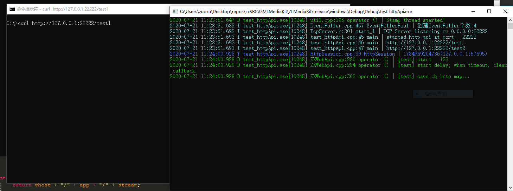
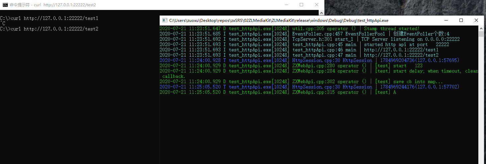

# ZLTookKit_dealy_test_in_webapi

目录结构

```
└─src
        test_httpApi.cpp    --- 服务器入口
        ZXWebApi.cpp        --- api实现。
        ZXWebApi.h
```
只是作为演示使用。

信号量这里也只是演示。

```c++
	api_regist1("/test2", [](API_ARGS1) {
		semaphore sem;
		bool result = false;
		DebugL << "[test] A" << endl;
		auto tag = EventPollerPool::Instance().getPoller()->doDelayTask(3000, [&]() {
			WarnL << "[snapbyhand] done TimeOut\t" << endl;
			sem.post();
			return 0;
		});
		sem.wait();
		DebugL << "[test] B" << endl;
		val["result"] = result;
		val["code"] = result ? API::Success : API::OtherFailed;
		val["msg"] = result ? "success" : "exe failed";
	});
```



